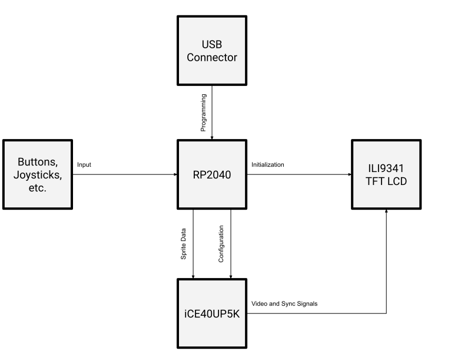
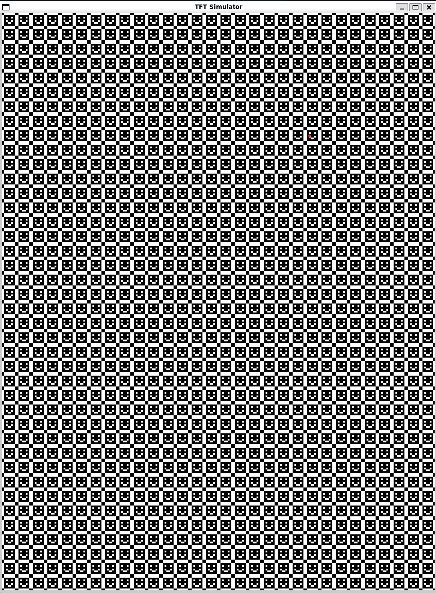

# ili9341_controller
Powered by an RP2040 and a Lattice iCE40UP5K, made by Ryan Hausmann.
Please note that everything was tested on Ubuntu running on Windows through WSL.

## Block diagram

Please note that this design has not been tested on actual hardware yet.

## Prerequisites
Run `sudo apt install make cmake gcc-arm-none-eabi libnewlib-arm-none-eabi libstdc++-arm-none-eabi-newlib build-essential clang bison flex libreadline-dev gawk tcl-dev libffi-dev git mercurial graphviz xdot pkg-config python3 libftdi-dev qtbase5-dev qtchooser qt5-qmake qtbase5-dev-tools python3-dev libboost-all-dev cmake libeigen3-dev git help2man perl python3 g++ verilator libsdl2-dev libsdl2-2.0-0`.
This is enough to do simulation with Verilator and SDL. To install the synthesis tools and the Pico SDK, run `./install_synthesis.sh`.

## Synthesis/Pico Build
Synthesis is handled by Yosys and Project Icestorm. The Pico firmware is compiled using cmake & pico-sdk.
### Building
The FPGA configuration is packaged into the RP2040 program. The `build/ili9341_controller.uf2` file can be built with `make` or `make pico`. This will compile the RP2040 program and also automatically build the FPGA configuration, with the files stored in the `build` directory. 
### Programming
On Windows, the generated uf2 file can be dragged into the Pico's drive folder.

## Simulation
Simulation has been implemented with Verilog and SDL.
### Building
To build the simulation program, run `make verilator`.
### Running
To run the simulation program, run `./build/Vili9341_controller`. The program will not do anything useful by default, but all the options can be viewed with the `--help` argument.
### Screen Simulation
To show the simulated screen output, run `./build/Vili9341_controller --screen-sim`. The `--screen-scale` argument can also be used to scale the screen, the default is 1x (240x320 px).
Below is a screenshot of a simulation with a bunch of smiley face sprites:

## Cleaning
`make clean` will remove all build files. The dependencies will remain in the `dep` folder.