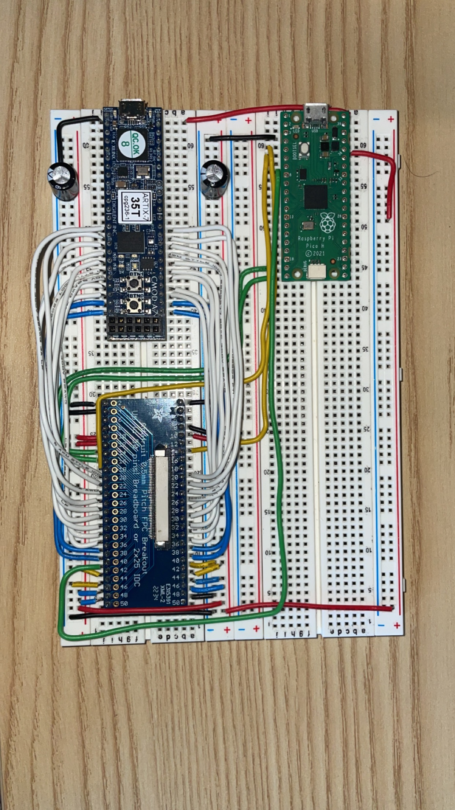

# ili9341_controller
A controller for a TFT display with a [ILI9341 display controller](https://cdn-shop.adafruit.com/datasheets/ILI9341.pdf), specifically the [MI0283QT-11](https://www.adafruit.com/product/1774). This design uses a Raspberry Pi Pico programmed in C to initialize the display and a Digilent CMOD A7-35T FPGA board programmed in Verilog to control it. Future plans include to remove the Pico and have the FPGA initialize the display as well.

## Compilation
*Note: currently only set up to be compiled on Ubuntu, but can be compiled on Windows using [WSL](https://learn.microsoft.com/en-us/windows/wsl/install).*

### Pico firmware
Required dependencies: `sudo apt install cmake gcc-arm-none-eabi libnewlib-arm-none-eabi libstdc++-arm-none-eabi-newlib`
The firmware for the RP Pico can be built using `make pico` in the top directory. Note that the Pico SDK will be installed as part of the build process. Once fully compiled, the file `/pico/build/ili9341_controller.uf2` can be uploaded to the Pico.

### Verilator simulator (w/ SDL)
Required dependencies: `sudo apt install libsdl2-dev verilator git help2man perl python3 make autoconf g++ flex bison ccache libgoogle-perftools-dev numactl perl-doc`
The Verilator simulator can be built with `make verilator`, and can be made & run using `make verilator_run`, or the file `/verilator_sim/obj_dir/ili9341_controller` can be executed.

### Bitstream files for FPGA
The bitstream files for the FPGA must be built in the [Xilinx Vivado software](https://www.xilinx.com/support/download.html). The `fpga` directory has all files required for building. The project is set up for the Digilent CMOD A7-35T as shown in the photos below (schematic soon).

## Photos
Here is the circuit as it is currently on a breadboard, without the display:

Here is the circuit with the display connected & displaying a color gradient:

Here is a screenshot of the Verilator simulator video output with the same above color gradient:

