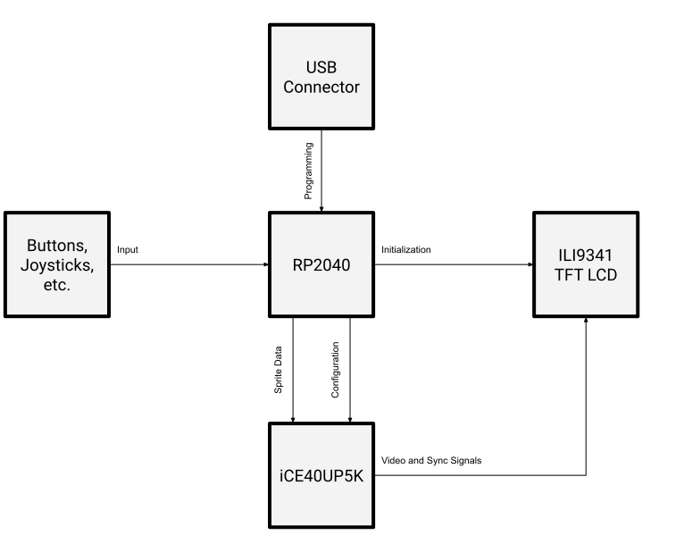

# ili9341_controller
Powered by an RP2040 and a Lattice iCE40UP5K, made by Ryan Hausmann.
Please note that everything was tested on Ubuntu running on Windows through WSL.

## Block diagram

Please note that this design has not been tested on actual hardware yet.

## Prerequisites
Run `./install_prereqs.sh` to automatically install all prerequisites (pico-sdk, icestorm, nextpnr, yosys, verilator, sdl).

## Synthesis/Pico Build
Synthesis is handled by Yosys and Project Icestorm. The Pico firmware is compiled using cmake & pico-sdk.
#### Building
The FPGA configuration is packaged into the RP2040 program. The `build/ili9341_controller.uf2` file can be built with `make` or `make pico`. This will compile the RP2040 program and also automatically build the FPGA configuration, with the files stored in the `build` directory. 
#### Programming
On Windows, the generated uf2 file can be dragged into the Pico's drive folder.

## Simulation
Simulation has been implemented with Verilog and SDL.
#### Building
To build the simulation program, run `make verilator`.
#### Running
To run the simulation program, run `./build/Vili9341_controller`. The program will not do anything useful by default, but all the options can be viewed with the `--help` argument.

## Cleaning
`make clean` will remove all build files. The dependencies will remain in the `dep` folder.